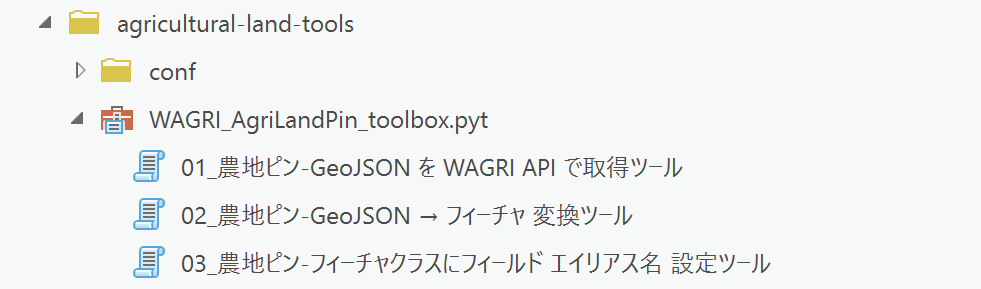

# Agricultural Land Pin Tools

## 概要
  
このページでは、[WAGRI](https://wagri.naro.go.jp/) 運営事務局が提供している農地APIの「[農地ピン情報取得API：SearchByCityCode](https://wagri.naro.go.jp/wagri_api/agriculturalland-searchbycitycode/)」を利用したデータの取得、フィーチャクラスへの変換、フィールド エイリアス名の設定を行う、ArcGIS Pro 用のサンプルの [Python ツールボックス](https://pro.arcgis.com/ja/pro-app/latest/arcpy/geoprocessing_and_python/a-quick-tour-of-python-toolboxes.htm) を公開しています。  

[ファイル一式](https://github.com/EsriJapan/agricultural-land-tools/releases/download/v1.0.0/agricultural-land-tools.zip) を入手し、ArcGIS Pro へ本ツールボックス を追加することで、ジオプロセシング ツールとして次の処理を行うことが可能です。  
  
**[WAGRI 農地ピン 処理用ツールボックス]** : [WAGRI_AgriLandPin_toolbox.pyt](https://github.com/EsriJapan/agricultural-land-tools/blob/main/WAGRI_AgriLandPin_toolbox.pyt )  

* **[01_農地ピン-GeoJson を WAGRI API で取得ツール]**
WAGRI運営事務局が提供している農地APIの「[農地ピン情報取得API：SearchByCityCode](https://wagri.naro.go.jp/wagri_api/agriculturalland-searchbycitycode/)」を利用して、指定した市区町村の農地ピン情報をGeojson 形式のファイルとしてダウンロードするツールです。  
※1: 本ツールを利用するには、予め、WAGRIの「データ利用・提供会員」のプランに加入し、**[conf]** フォルダー下の **wagri_config.ini** ファイルに `id` `secret` を設定して頂く必要があります。WAGRIの「データ利用・提供会員」のプランの詳細は、[WAGRIの利用料金](https://wagri.naro.go.jp/about_wagri/fee/) や [利用申請](https://wagri.naro.go.jp/about_wagri/terms/) をご参照ください。
※2: 本ツールで一覧に出てくる市区町村は、**[conf]** フォルダー下の **city_code.csv** ファイルでカスタマイズ可能です。カスタマイズする場合は、csvファイルのヘッダー情報（code,name）はそのまま残し、2行目以降を書き換えてご利用ください。なお、code の値は 5桁 で定義する必要がありますのでご注意ください。  

* **[02_農地ピン-GeoJson → フィーチャ 変換ツール]**
農地ピンの Geojson 形式のファイルを ArcGIS のフィーチャクラス に変換するツールで、複数の Geojson 形式のファイルを指定可能です。  

* **[03_農地ピン-フィーチャクラスにフィールド エイリアス名 設定ツール]**
農地ピンのフィーチャクラスに、フィールド エイリアス名を設定するツールで、複数のフィーチャクラスを指定可能です。  
※3: 本ツールで設定するフィールド エイリアス名は、「[農地ピン情報取得API：SearchByCityCode](https://wagri.naro.go.jp/wagri_api/agriculturalland-searchbycitycode/)」のレスポンスデータ定義の`名称`と`値`をもとに、`値`をフィールド エイリアス名に設定しています。カスタマイズする場合は、**[conf]** フォルダー下の **agri_land_pin_fields.txt** ファイルでカスタマイズ可能です。カスタマイズする場合は、txtファイルのヘッダー情報（名称;値）はそのまま残し、2行目以降を書き換えてご利用ください。なお、名称と値の区切り文字は半角セミコロン`;`で定義する必要がありますのでご注意ください。  

## 免責事項
* 本リポジトリに含まれる [Python ツールボックス](https://pro.arcgis.com/ja/pro-app/latest/arcpy/geoprocessing_and_python/a-quick-tour-of-python-toolboxes.htm) はサンプルとして提供しているものであり、動作に関する保証、および製品ライフサイクルに従った Esri 製品サポート サービスは提供しておりません。
* 本ツールに含まれるツールによって生じた損失及び損害等について、一切の責任を負いかねますのでご了承ください。
* 弊社で提供しているEsri 製品サポートサービスでは、本ツールに関しての Ｑ＆Ａ サポートの受付を行っておりませんので、予めご了承の上、ご利用ください。詳細は[
ESRIジャパン GitHub アカウントにおけるオープンソースへの貢献について](https://github.com/EsriJapan/contributing)をご参照ください。

## ライセンス
Copyright 2023 Esri Japan Corporation.

Apache License Version 2.0（「本ライセンス」）に基づいてライセンスされます。あなたがこのファイルを使用するためには、本ライセンスに従わなければなりません。
本ライセンスのコピーは下記の場所から入手できます。

> http://www.apache.org/licenses/LICENSE-2.0

適用される法律または書面での同意によって命じられない限り、本ライセンスに基づいて頒布されるソフトウェアは、明示黙示を問わず、いかなる保証も条件もなしに「現状のまま」頒布されます。本ライセンスでの権利と制限を規定した文言については、本ライセンスを参照してください。

ライセンスのコピーは本リポジトリの[ライセンス ファイル](./LICENSE)で利用可能です。
